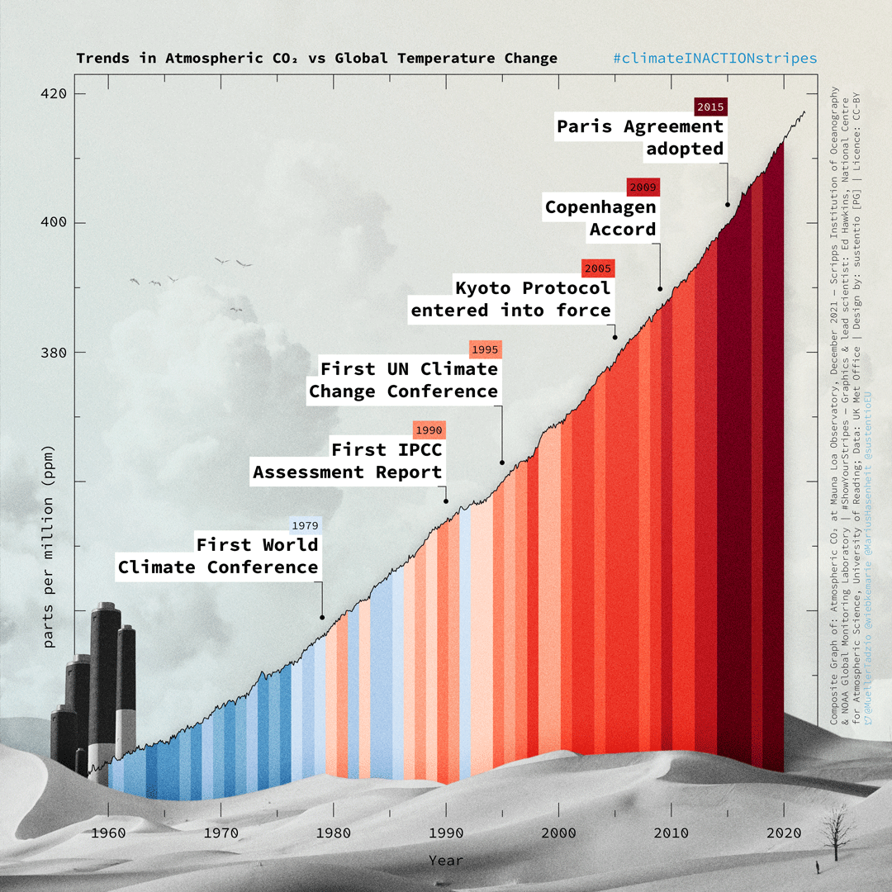

### Course Slides

- 2024-2025 course about LLM for M2 TAL (Nancy):
    - [Intro, embeddings, tokenizers](https://olki.loria.fr/cerisara/lexres/2024intro.html)
- [IDESSAI'2024](https://idessai.eu/) (Saarbrucken, DFKI):
    - [Intro LLM](https://olki.loria.fr/cerisara/talks/2024llmintro.html)
    - [PEFT](https://olki.loria.fr/cerisara/talks/2024peft.html)

-------------

### Tout va bien...

-------------

### Misc

- [100% terminal: old-school ou tendance ?](nogui.html)
- [Federated learning open source platforms](fedDL.html)
- [Les arbres de décision ne sont pas explicables](xai.html)

-------------

### Citations

- "Nous manquons d’ambition, car nous avons très peur de l’échec. En France, on crève parfois de ne pas oser." [Julia De Funès](https://www.lecho.be/opinions/general/julia-de-funes-la-mecanique-metro-boulot-dodo-est-mise-a-mal-avec-le-teletravail-et-c-est-tant-mieux/10252395.html)
- A ne surtout pas rater: [XKCD](https://xkcd.com/)

