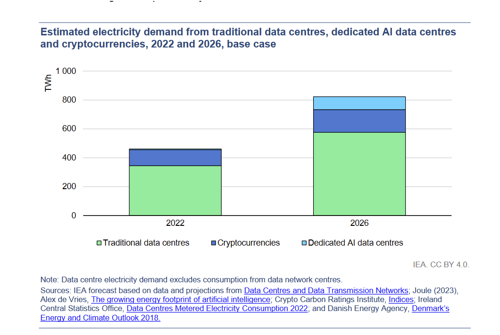

### Course Slides

- 2024-2025 course about LLM for M2 TAL (Nancy):
    - [Intro, embeddings, tokenizers](https://olki.loria.fr/cerisara/lexres/2024intro.html)
    - Solutions: [BPE](https://olki.loria.fr/cerisara/lexres/bpe.py), [TripletNet](https://olki.loria.fr/cerisara/lexres/triplet.py)
    - [Attention](https://olki.loria.fr/cerisara/lexres/2024att.html); [solution Exo](https://olki.loria.fr/cerisara/lexres/selfatt.py)
    - [LLM](https://olki.loria.fr/cerisara/lexres/2024llm.html); [solution Exo scaling law](https://olki.loria.fr/cerisara/lexres/scale.py)
- 2024-2025 course about LLM for M2 Sciences Cognitives (Nancy):
    - [RAG](https://olki.loria.fr/cerisara/lexres/2024methodoIntro.html)
- [IDESSAI'2024](https://idessai.eu/) (Saarbrucken, DFKI):
    - [Intro LLM](https://olki.loria.fr/cerisara/talks/2024llmintro.html)
    - [PEFT](https://olki.loria.fr/cerisara/talks/2024peft.html)
- [HUMANOIDS'2024](https://olki.loria.fr/cerisara/talks/2024humanoids.html)

-------------

### Effondrement climatique et sociétal

Aurélien Barrau a raison sur le fond (cf. [video youtube](https://www.youtube.com/watch?v=XNtucQbEEls)),
mais je pense qu'il définit mal sa cible lorsqu'il accuse l'"IA".
Je suis totalement d'accord avec lui sur son constat, l'inutilité des "mesurettes" actuelles et l'urgence à changer
radicalement nos mode de vie, ainsi que l'usage des technologies en général et celles d'IA en particulier, même si
ces dernières ne sont qu'une goutte d'eau dans une mer de problèmes bien plus importants (cf. quelques chiffres ci-dessous).
Mais s'il faut effectivement remettre en cause le déploiement de masse de ces technologies tel qu'il est réalisé aujourd'hui, la recherche elle, doit continuer.
Car les LLM sont les premiers artefacts jamais conçus capables d'une forme de raisonnement:
ce sont les seuls outils disponibles pour commencer à comprendre une partie de nos propres capacités, et explorer un
nouveau monde, le territoire de la cognition, tout comme les astrophysiciens explorent des mondes lointains à jamais
inaccessibles.

S'interdire de comprendre, c'est de l'obscurantisme.
Refuser notre zombification sociétale et de détruire la vie sur Terre, c'est du bon sens.

Estimation of carbon costs 

|   | Carbon cost (T.CO2) |
|:-:|:-------------------:|
| 560 persons virtual conf | 10 |
| 560 persons F2F conf | 274 |
| 18000 persons virtual conf | 176 |
| 18000 persons F2F conf | 10348 |
| emissions 1 car/year [source](https://www.hellocarbo.com/blog/calculer/empreinte-carbone-voiture/) | 2.2 |
| emissions cars in France/year | 65M |
| **training Bloom** | 25 |

Sources: [UE](https://www.europarl.europa.eu/topics/fr/article/20190313STO31218/emissions-de-co2-des-voitures-faits-et-chiffres-infographie),
[6connex](https://www.6connex.com/sustainability/),
[statista](https://fr.statista.com/statistiques/1422808/emissions-voiture-essence-diesel-france/)

-------------

### Tout va bien...

-------------

### Misc

- [100% terminal: old-school ou tendance ?](nogui.html)
- [Federated learning open source platforms](fedDL.html)
- [Les arbres de décision ne sont pas explicables](xai.html)

-------------

### Citations

- "Nous manquons d’ambition, car nous avons très peur de l’échec. En France, on crève parfois de ne pas oser." [Julia De Funès](https://www.lecho.be/opinions/general/julia-de-funes-la-mecanique-metro-boulot-dodo-est-mise-a-mal-avec-le-teletravail-et-c-est-tant-mieux/10252395.html)
- A ne surtout pas rater: [XKCD](https://xkcd.com/)

