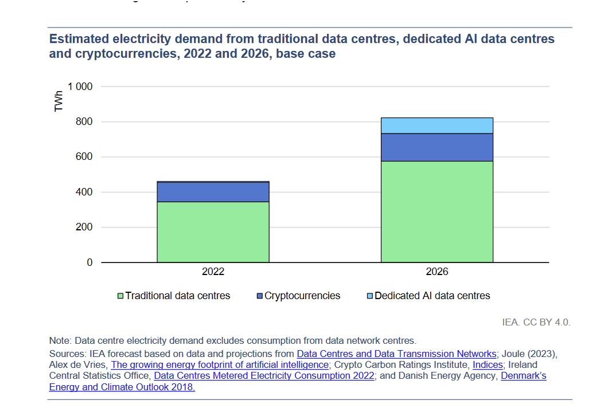
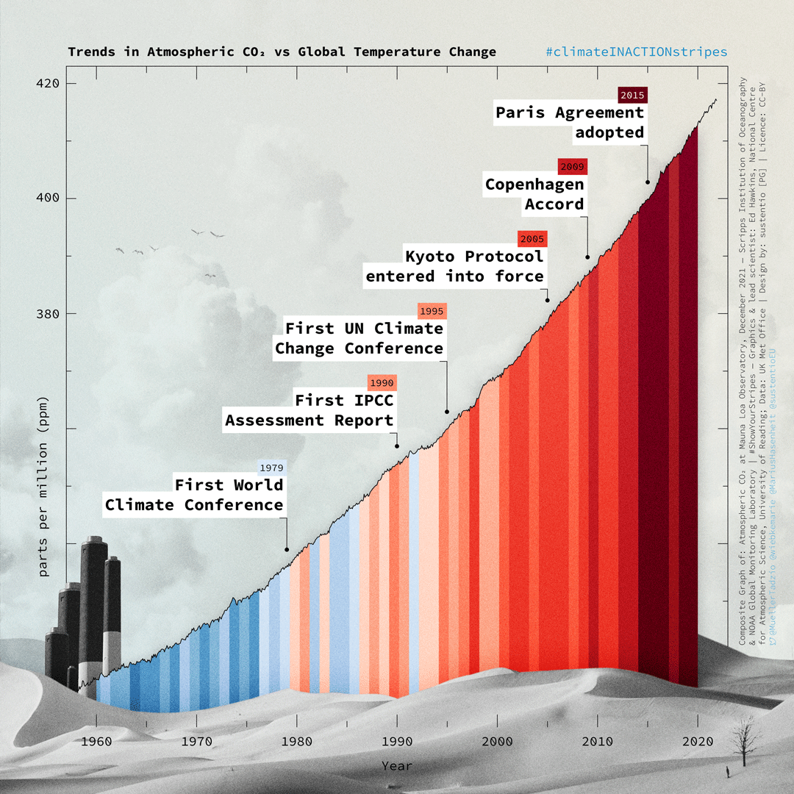

### 2024-2025 Talks slides

- GDR [NLP day at Orange](https://gdr-tal-jcp2025.sciencesconf.org/) : [slides](https://olki.loria.fr/cerisara/talks/gdr25.html)

(I'm sorry, but I have removed most of my talks and courses, because I've not had the time to fully check
every illustration source and licence. I'll post them back when I'll have double checked all this...)

-------------

### Effondrement climatique et sociétal

Aurélien Barrau a raison sur le fond (cf. [video youtube](https://www.youtube.com/watch?v=XNtucQbEEls)),
mais je pense qu'il définit mal sa cible lorsqu'il accuse l'"IA".
Je suis totalement d'accord avec lui sur son constat, l'inutilité des "mesurettes" actuelles et l'urgence à changer
radicalement nos mode de vie, ainsi que l'usage des technologies en général et celles d'IA en particulier, même si
ces dernières ne sont qu'une goutte d'eau dans une mer de problèmes bien plus importants (cf. quelques chiffres ci-dessous).
Mais s'il faut effectivement remettre en cause le déploiement de masse de ces technologies tel qu'il est réalisé aujourd'hui, la recherche elle, doit continuer.
Car les LLM sont les premiers artefacts jamais conçus capables d'une forme de raisonnement:
ce sont les seuls outils disponibles pour commencer à comprendre, peut-être, une partie de nos propres capacités.
Le terme d'"intelligence" est, ou n'est pas, adapté pour les décrire, c'est selon l'acceptation de la définition
d'intelligence de chacun, mais dans tous les cas, ces outils nous offrent une nouvelle forme de "raisonnement" complexe
connu de nous, et nous n'en connaissons que deux autres: celles des animaux et de l'humanité.
Ce sont les seules autres entités physiques capables de communiquer de manière complexe avec nous.
Comment ne pas vouloir explorer ce nouveau monde ? C'est une nouvelle opportunité, tellement rare, pour en apprendre plus
sur la nature, sur l'évolution, voire sur nos propres facultés cognitives.

S'interdire de comprendre, c'est de l'obscurantisme.
Refuser notre zombification sociétale et de détruire la vie sur Terre, c'est du bon sens.

### Quelques chiffres récents liés au carbon cost de l'IA

- coût des usages numériques globaux: entre 2% et 4% du coût global [source](https://theshiftproject.org/app/uploads/2025/02/The-Shift-Project-What-virtual-worlds-for-a-sustainable-real-world-Final-report-March-2024_ENG.pdf)
- coût de l'IA (estimation de fin 2024): inférieur à 1% [source](https://www.icef.go.jp/wp-content/themes/icef_new/pdf/roadmap/2024/15_ICEF2.0%20GHG%20Emissions%20from%20AI_stand%20alone.pdf)
- 2023-2025 est une phase d'augmentation rapide pour l'IA (+150% selon [source](https://www.reuters.com/sustainability/climate-energy/tech-giants-indirect-emissions-rose-150-three-years-ai-expands-un-agency-says-2025-06-05)), augmentation probablement due en grande partie au déploiement des IA en accès libre pour le grand public. Notons que ce rapport mesure en fait l'acroissement du coût des grandes entreprises du secteur sans distinguer ni les usages ni les raisons de cet acroissement; de plus, les impacts positifs des IA (optimisation des ressources, des déchets, du temps de travail...) ne sont jamais mesurés. Enfin, rien ne dit que cette phase de croissance se prolongera, car elle correspond à une phase où les grandes entreprises cherchent à gagner du marché, et la recherche réduit drastiquement les coûts des IA (voir par ex. DeepSeek).

En comparaison avec le coût carbone des voitures individuelles:

- coût moyen par voiture: 4.6 TCO2 [source](https://www.epa.gov/greenvehicles/greenhouse-gas-emissions-typical-passenger-vehicle); 106 gCO2/km en Europe [source](https://www.eea.europa.eu/en/analysis/indicators/co2-performance-of-new-passenger)
- 10% du coût global, i.e., 3.8 Gt CO₂ en 2023 selon [source](https://www.iea.org/energy-system/transport/cars-and-vans)
- coût des transports: entre 15 et 23% selon [source](https://www.ipcc.ch/report/ar6/wg3/chapter/chapter-10)
- En Europe, les voitures électriques ont un coût relatif (tout compris) de 75% des voitures à combustion [source](https://theicct.org/publication/electric-cars-life-cycle-analysis-emissions-europe-jul25)
- Mais le nombre de voitures total continue d'augmenter rapidement [source](https://iea.blob.core.windows.net/assets/33e2badc-b839-4c18-84ce-f6387b3c008f/CO2Emissionsin2023.pdf)
- Et la taille des voitures continue d'augmenter aussi [source](https://apnews.com/article/7da17af9a585feb8945dffff133e9335)

### Chiffres un peu plus anciens récupérés en 2024

Estimation of carbon costs 

|   | Carbon cost (T.CO2) |
|:-:|:-------------------:|
| 560 persons virtual conf | 10 |
| 560 persons F2F conf | 274 |
| 18000 persons virtual conf | 176 |
| 18000 persons F2F conf | 10348 |
| emissions 1 car/year [source](https://www.hellocarbo.com/blog/calculer/empreinte-carbone-voiture/) | 2.2 |
| emissions cars in France/year | 65M |
| **training Bloom** | 25 |

Sources: [UE](https://www.europarl.europa.eu/topics/fr/article/20190313STO31218/emissions-de-co2-des-voitures-faits-et-chiffres-infographie),
[6connex](https://www.6connex.com/sustainability/),
[statista](https://fr.statista.com/statistiques/1422808/emissions-voiture-essence-diesel-france/)

-------------

### Tout va bien...

<a href="https://vert.eco/articles/les-populations-dinsectes-seffondrent-partout-dans-le-monde-on-decrypte-cinq-etudes-scientifiques-marquantes-sur-le-sujet">63% des insectes volants</a> ont disparu en 3 ans en Grande Bretagne

-------------

### Misc

- [100% terminal: old-school ou tendance ?](nogui.html)
- [Federated learning open source platforms](fedDL.html)
- [Les arbres de décision ne sont pas explicables](xai.html)
- A ne surtout pas rater: [XKCD](https://xkcd.com/)

### Citation

- Shelley Wright (International lawyer, books author): "[Copyright is] ... the quintessential representations of the modern, public world of bourgeois expansion, male dominance and European colonial influence ..."
- Voir aussi: https://www.youtube.com/watch?v=x3rptRn6GeA

